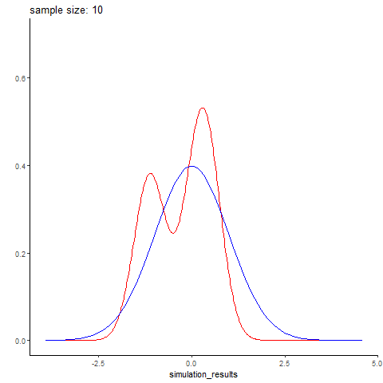

This was another (very) mini-project, done to fuss with gganimate.

If we flip 4 coins, we don't expect to get 2 heads and 2 tails. By the law of large numbers, we expect after many coin flips, we'll converge to our theoretical mean

Similarly, if we generate a small number of data points from a normal distribution (with rnorm), we're not expecting them to look very normal. On the other hand, we expect large simulated datasets to be fairly normally distributed. I thought this would make a fun gif:



Unsuprisingly, We see our simulated data (in red) gets closer to the theoretical normal curve (blue) as sample size increases.

``` r
library(gganimate)
library(ggplot2)
library(dplyr)
```

``` r
gen_normal_simulations <- function(start, stop, step){
  #generate simulated normally distributed data
  #(start=10, stop=100, step=10) means generate a DF with 10 simulated data points (labeled 10), then 20 data points (labeled 20), so on until stop
  n <- seq(start, stop, step)
  sim <- sapply(n, function(x){rnorm(n=x)}) %>% unlist()
  result <- data.frame(simulation_results=sim, sample_size=rep(n,n))
  return(result)
  }

animate_normal_simulations <- function(start,stop,step, filename="test.gif"){
  #create an animation showing how well each simulated data set of sizes start to stop follows a real normal curve
  sim <- gen_normal_simulations(start, stop,step)
  p <- sim %>% ggplot(aes(x=simulation_results))+
    stat_density(color="red", geom="line")+
    stat_function(data = data.frame(x=c(-3,3)), aes(x), fun = dnorm, color="blue")+
    ylab("")+ theme_classic()+ylim(0,.6)+
    transition_states(sample_size)+
    labs(title = 'sample size: {closest_state}')
  animation <- animate(plot = p, rewind = FALSE, fps=20, start_pause = 10, nframes=2*length(unique(sim$sample_size))+10, renderer = gifski_renderer(loop = F))
  anim_save(filename = filename, animation=animation)
}
```

``` r
cars %>% ggplot(aes(x=speed, y=dist))+geom_point()
```


