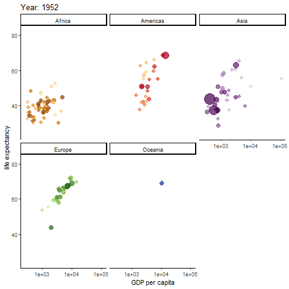
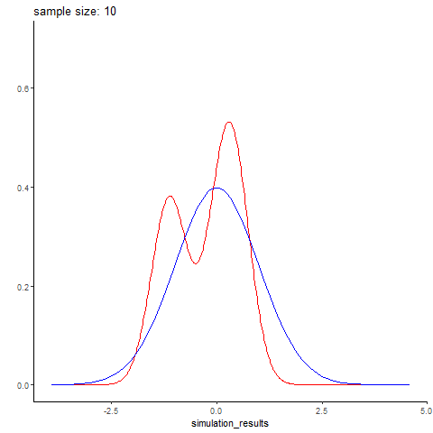
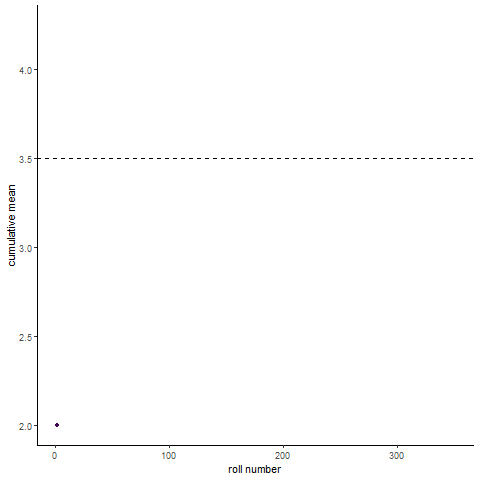
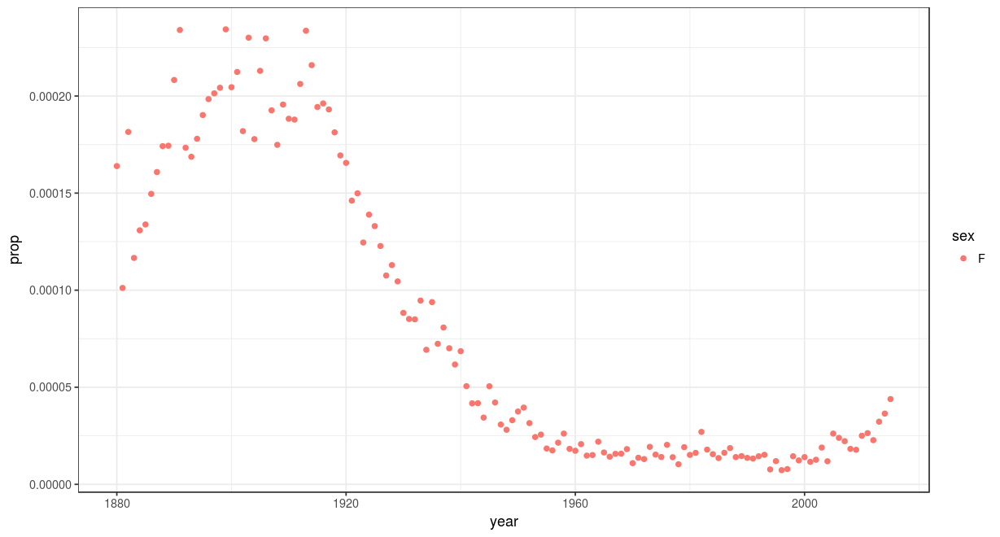

I am a complete sucker for "nonstandard" visualizations-- animated graphs, interactive graphs, that kind of thing. These can be overkill if the data doesn't require it. Still they're a lot of fun, and can be a great tool for breaking down otherwise indigestible amounts of data

<br><br>

Animated graphs
===============

------------------------------------------------------------------------

Mostly I've used gganimate for this, which easily intergrates with GGplot, turning a plot into a standard gif.

``` r
library(gganimate)
library(dplyr) #data wrangling, pipes, etc.
library(ggplot2)
library(scales) #smart plot scaling
library(viridis) #just a pretty color scheme
library(gapminder)
```

### Gapminder

------------------------------------------------------------------------

Possibly the most famous animated graph, from Hans Rosling's gapminder dataset. Check out his [ted talk](https://www.ted.com/talks/hans_rosling_shows_the_best_stats_you_ve_ever_seen). The graph shows the improvements we have made in GDP and life expectancy by contintent over time. Each buble indicates a country, bubble size indicates that countries population

``` r
anim <- ggplot(gapminder, aes(gdpPercap, lifeExp, size = pop, colour = country)) +
  geom_point(alpha = 0.7, show.legend = FALSE) +
  scale_colour_manual(values = country_colors) +
  scale_size(range = c(2, 12)) +
  scale_x_log10() + theme_classic()+
  facet_wrap(~continent) +
  # Here comes the gganimate specific bits. What will determine each frame of gif and how should we label the frame:
  labs(title = 'Year: {frame_time}', x = 'GDP per capita', y = 'life expectancy') +
  transition_time(year) +
  ease_aes('linear')
#anim_save(anim, file="gapminder.gif")
```



### Normal distribution simulation by sample size

------------------------------------------------------------------------

Here's an example I whipped up quickly, simuating different sized batches of normally distributed data with rnorm, and comparing it to a real normal curve. Small data sets are predictably wonky, and you get better and better approximations of the normal distribution with larger sample sizes. Here simulated datasets is in red, while the real normal curve is in blue. The code is below (again, its fairly simple)

The code to generate it wasn't terribly complex

``` r
gen_normal_simulations <- function(start, stop, step){
  #generate simulated random data
  #(start=10, stop=100, step=10) means generate a DF with 10 simulated data points (labeled 10), then 20 data points (labeled 20), so on until stop
  n <- seq(start, stop, step)
  sim <- sapply(n, function(x){rnorm(n=x)}) %>% unlist()
  result <- data.frame(simulation_results=sim, sample_size=rep(n,n))
  return(result)
  }

animate_normal_simulations <- function(start,stop,step, filename="test.gif"){
  #create an animation showing how well each simulated data set of sizes start to stop follows a real normal curve
  sim <- gen_normal_simulations(start, stop,step)
  p <- sim %>% ggplot(aes(x=simulation_results))+
    stat_density(color="red", geom="line")+
    stat_function(data = data.frame(x=c(-3,3)), aes(x), fun = dnorm, color="blue")+
    ylab("")+xlab("")+ theme_classic()+ylim(0,.7)+
      #gganimate specific bits. each frame is a sample size, which is displayed in our frame label:
        transition_states(sample_size)+
    labs(title = 'sample size: {closest_state}')
  animation <- animate(plot = p, rewind = FALSE, fps=20, start_pause = 10, nframes=2*length(unique(sim$sample_size))+10+60, end_pause=60, renderer = gifski_renderer(loop = T))
  anim_save(filename = filename, animation=animation)
}
```



### Law of large numbers demo

------------------------------------------------------------------------

Here's a fun visualization of the law of large numbers. If you roll a die 10 times and take the average of the rolls, you could be far off the expected mean of the die. Roll the die enough and (assume its fair) you will eventually converge to the expected mean

``` r
roll_dice <- function(n, k){
  #simulate n dice rolls of a k sided die, return a df with the cumulative mean
  rolls_df <- data.frame(rolls=replicate(n, sample(1:k,1))) 
  rolls_df <- mutate(rolls_df, cummean=cummean(rolls), rollnumber=seq.int(nrow(rolls_df)), distance_from_mean=abs(cummean-mean(1:k)))
  return(rolls_df)
}

animate_roll_dice <- function(n,k,filename="rolls.gif"){
    #animate n dice rolls of a k sided die, return a gif of cumulative mean by roll
  rolls <- roll_dice(n,k)
  anim <- rolls %>% ggplot(aes(x=rollnumber, y=cummean, color=distance_from_mean))+geom_line()+geom_point(aes(group = seq_along(rollnumber)))+
    scale_x_continuous(breaks=pretty_breaks())+
    scale_color_viridis()+theme_classic()+
    geom_hline(aes(yintercept=(mean(1:k))), linetype="dashed")+
    transition_reveal(rollnumber)+
    labs(x="roll number", y="cumulative mean")+
    theme(legend.position = "none")
  anim <- animate(plot = anim, nframes=(n), renderer=gifski_renderer(loop = T), start_pause=10, end_pause=60, fps=20)
  save_animation(anim, file=filename)
}

#animate_roll_dice(300,6)
```



Interactive Graphs
==================

Rshiny and plotly are my favorite tools for this. Rshiny even provides free web hosting for 5 interactive graphs. Here's a fun example I made, leveraging the babynames dataset, to show a names popularity over time and by gender, for two million babies in the US. [check out the link](https://thomas-davis-eeb4100.shinyapps.io/questionthreeapp/). Users can type in whatever name their curious. Some of my favorites:



compared with 
