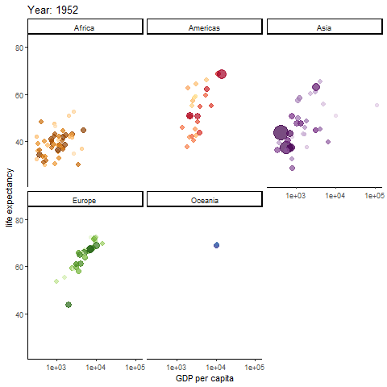
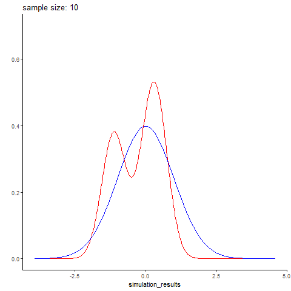
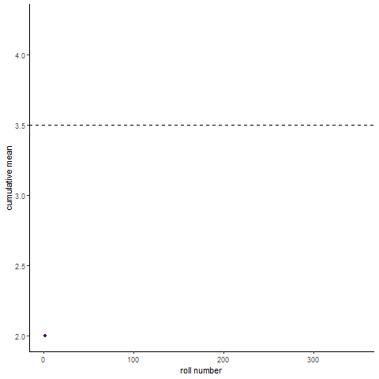
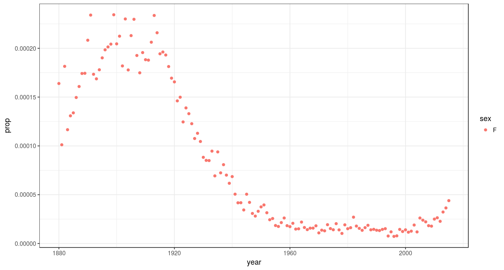

I am a complete sucker for "nonstandard" visualizations-- animated graphs, interactive graphs, that kind of thing. These can be  overkill if the data doesn't require it. Still they're a lot of fun, and can be a great tool for breaking down otherwise indigestible amounts of data

<br><br>

# Animated graphs
***
Mostly I've used gganimate for this, which easily intergrates with GGplot, turning a plot into a standard gif.

```{r, message=FALSE, warning=FALSE}
library(gganimate)
library(dplyr) #data wrangling, pipes, etc.
library(ggplot2)
library(scales) #smart plot scaling
library(viridis) #just a pretty color scheme
library(gapminder)
```


### Gapminder
***

Possibly the most famous animated graph, from Hans Rosling's gapminder dataset. Check out his [ted talk](https://www.ted.com/talks/hans_rosling_shows_the_best_stats_you_ve_ever_seen). The graph shows the improvements we have made in GDP and life expectancy by contintent over time. Each buble indicates a country, bubble size indicates that countries population


```{r}

anim <- ggplot(gapminder, aes(gdpPercap, lifeExp, size = pop, colour = country)) +
  geom_point(alpha = 0.7, show.legend = FALSE) +
  scale_colour_manual(values = country_colors) +
  scale_size(range = c(2, 12)) +
  scale_x_log10() + theme_classic()+
  facet_wrap(~continent) +
  # Here comes the gganimate specific bits. What will determine each frame of gif and how should we label the frame:
  labs(title = 'Year: {frame_time}', x = 'GDP per capita', y = 'life expectancy') +
  transition_time(year) +
  ease_aes('linear')
#anim_save(anim, file="gapminder.gif")
```




### Normal distribution simulation by sample size
***

Here's an example I whipped up quickly, simuating different sized batches of normally distributed data with rnorm, and comparing it to a real normal curve. Small data sets are predictably wonky, and you get better and better approximations of the normal distribution with larger sample sizes. Here simulated datasets is in red, while the real normal curve is in blue. The code is below (again, its fairly simple)

The code to generate it wasn't terribly complex
```{r setup, include=FALSE}
knitr::opts_chunk$set(echo = TRUE)
knitr::opts_chunk$set(fig.path="../assets/foo/")
```

```{r}
gen_normal_simulations <- function(start, stop, step){
  #generate simulated random data
  #(start=10, stop=100, step=10) means generate a DF with 10 simulated data points (labeled 10), then 20 data points (labeled 20), so on until stop
  n <- seq(start, stop, step)
  sim <- sapply(n, function(x){rnorm(n=x)}) %>% unlist()
  result <- data.frame(simulation_results=sim, sample_size=rep(n,n))
  return(result)
  }

animate_normal_simulations <- function(start,stop,step, filename="test.gif"){
  #create an animation showing how well each simulated data set of sizes start to stop follows a real normal curve
  sim <- gen_normal_simulations(start, stop,step)
  p <- sim %>% ggplot(aes(x=simulation_results))+
    stat_density(color="red", geom="line")+
    stat_function(data = data.frame(x=c(-3,3)), aes(x), fun = dnorm, color="blue")+
    ylab("")+xlab("")+ theme_classic()+ylim(0,.7)+
      #gganimate specific bits. each frame is a sample size, which is displayed in our frame label:
        transition_states(sample_size)+
    labs(title = 'sample size: {closest_state}')
  animation <- animate(plot = p, rewind = FALSE, fps=20, start_pause = 10, nframes=2*length(unique(sim$sample_size))+10+60, end_pause=60, renderer = gifski_renderer(loop = T))
  anim_save(filename = filename, animation=animation)
}
```




### Law of large numbers demo
***
Here's a fun visualization of the law of large numbers. If you roll a die 10 times and take the average of the rolls, you could be far off the expected mean of the die. Roll the die enough and (assume its fair) you will eventually converge to the expected mean 


```{r}
roll_dice <- function(n, k){
  #simulate n dice rolls of a k sided die, return a df with the cumulative mean
  rolls_df <- data.frame(rolls=replicate(n, sample(1:k,1))) 
  rolls_df <- mutate(rolls_df, cummean=cummean(rolls), rollnumber=seq.int(nrow(rolls_df)), distance_from_mean=abs(cummean-mean(1:k)))
  return(rolls_df)
}

animate_roll_dice <- function(n,k,filename="rolls.gif"){
    #animate n dice rolls of a k sided die, return a gif of cumulative mean by roll
  rolls <- roll_dice(n,k)
  anim <- rolls %>% ggplot(aes(x=rollnumber, y=cummean, color=distance_from_mean))+geom_line()+geom_point(aes(group = seq_along(rollnumber)))+
    scale_x_continuous(breaks=pretty_breaks())+
    scale_color_viridis()+theme_classic()+
    geom_hline(aes(yintercept=(mean(1:k))), linetype="dashed")+
    transition_reveal(rollnumber)+
    labs(x="roll number", y="cumulative mean")+
    theme(legend.position = "none")
  anim <- animate(plot = anim, nframes=(n), renderer=gifski_renderer(loop = T), start_pause=10, end_pause=60, fps=20)
  save_animation(anim, file=filename)
}

#animate_roll_dice(300,6)
```





# Interactive Graphs

Rshiny and plotly are my favorite tools for this. Rshiny even provides free web hosting for 5 interactive graphs. Here's a fun example I made, leveraging the babynames dataset, to show a names popularity over time and by gender, for two million babies in the US. 
[check out the link](https://thomas-davis-eeb4100.shinyapps.io/questionthreeapp/). Users can type in whatever name their curious. 
Some of my favorites: 



compared with 


Heres a plotly example from my research: dealing with a huge heatmap. 
The researcher I was working with was interested in a set of ~800 genes, across more than 1000 patients, divided into two sets. Without the interactive aspect this would be a completely overwhelming amount of data, since they wanted to be able to see the gene level expression values. In this case, plotly saved the day.


```{r, include=FALSE}

library(dplyr)
library(plotly)
TCGA_data <- read.table("C://Users//thoma//Documents//xenaDownload.tsv", sep="\t", header=TRUE)
#expression of immune related genes. Immune genes list from pan-cancer immunogenic anlaysis. 
#Dowloaded TCGA data with xena browser
TCGA_data <- TCGA_data[, -grep("unknown", colnames(TCGA_data))]
#take out the unknown genes
TCGA_data <- mutate(TCGA_data, sample=as.character(sample))
TCGA_data <- filter(TCGA_data, !grepl("-11", sample))
#get rid of all those samples from normal tissue
TCGA_data <- mutate(TCGA_data, sample=gsub('.{3}$', '', sample))
#get rid of the last three characters of the sample name string.

BRCA_mutants <- "TCGA-A1-A0SH
TCGA-A1-A0SJ
TCGA-A2-A0D2
TCGA-AN-A0AL
TCGA-AN-A0FL
TCGA-AN-A0FX
TCGA-AO-A124
TCGA-C8-A12K
TCGA-D8-A147
TCGA-E2-A14N
TCGA-A2-A0SU
TCGA-A2-A0T0
TCGA-A8-A07R
TCGA-A8-A097
TCGA-A8-A09A
TCGA-A8-A09W
TCGA-AO-A03V
TCGA-B6-A0I8
TCGA-B6-A0RG
TCGA-BH-A0AZ
TCGA-BH-A0B4
TCGA-BH-A0BZ
TCGA-E2-A15S
"
#excluded TCGA-BH-A0BL. This is a list of BRCA1 and 2 germline mutants. 
#from Comprehensive molecular portraits of human breast tumours, 2012.
BRCA_mutants <- strsplit(BRCA_mutants, split="\\s+") %>% unlist()
#list of IDs with BRCA mutations 
germline <- TCGA_data %>% filter(sample %in% BRCA_mutants)
TCGA_data <- TCGA_data %>% filter(!(sample %in% BRCA_mutants))
#seperate out germline brca mutants from non mutants


TCGA_data <- TCGA_data[1:60,]
gene_matrix <- TCGA_data
gene_matrix_without_samplenames <- gene_matrix[, -grep("sample", colnames(gene_matrix))]
na_rows  <- apply(is.na(as.matrix(gene_matrix_without_samplenames)), 1, all)
gene_matrix <- gene_matrix[!na_rows, ]
#take out those rows that are all NA, except for the sample name. 
TNBC_IDs <- c("TCGA-EW-A1P7
TCGA-AO-A128
TCGA-B6-A0IQ
TCGA-E2-A574
TCGA-B6-A0IK
TCGA-AN-A0AT
TCGA-AO-A03U
TCGA-B6-A0RE
TCGA-AN-A0FX
TCGA-D8-A27F
TCGA-AO-A0JL
TCGA-C8-A27B
TCGA-AR-A0U1
TCGA-A2-A0SX
TCGA-BH-A0B3
TCGA-D8-A27H
TCGA-A7-A5ZV
TCGA-A2-A04U
TCGA-D8-A143
TCGA-E2-A1LK
TCGA-HN-A2NL
TCGA-BH-A0E0
TCGA-A2-A0T2
TCGA-A2-A0ST
TCGA-B6-A0RN
TCGA-S3-AA10
TCGA-A8-A09X
TCGA-A2-A1G6
TCGA-E2-A1LL
TCGA-BH-A42U
TCGA-A2-A0D0
TCGA-BH-A18T
TCGA-E2-A1LI
TCGA-EW-A1P8
TCGA-OL-A66I
TCGA-AR-A2LH
TCGA-D8-A1XQ
TCGA-OL-A6VO
TCGA-AR-A5QQ
TCGA-A7-A0DA
TCGA-A7-A26F
TCGA-AN-A0AL
TCGA-B6-A0IE
TCGA-AO-A12F
TCGA-AN-A04D
TCGA-E2-A150
TCGA-B6-A0RT
TCGA-C8-A26Y
TCGA-EW-A1PH
TCGA-BH-A0BG
TCGA-E2-A14R
TCGA-EW-A1P4
TCGA-A2-A3XX
TCGA-E9-A22G
TCGA-GM-A2DH
TCGA-A7-A6VV
TCGA-AQ-A54N
TCGA-D8-A13Z
TCGA-BH-A0B9
TCGA-A2-A0YM
TCGA-BH-A0BW
TCGA-A7-A26G
TCGA-AR-A1AY
TCGA-E2-A14X
TCGA-A8-A08R
TCGA-E2-A573
TCGA-GM-A3XL
TCGA-A1-A0SO
TCGA-GM-A2DI  
TCGA-AC-A2QH
TCGA-B6-A0RU
TCGA-LL-A441
TCGA-BH-A18V
TCGA-BH-A0E6
TCGA-GM-A2DB
TCGA-AC-A2BK
TCGA-OL-A97C
TCGA-C8-A26X
TCGA-AR-A0U4
TCGA-BH-A18G
TCGA-E2-A14N
TCGA-B6-A402
TCGA-BH-A0WA
TCGA-BH-A0AV
TCGA-E2-A1L7
TCGA-C8-A12V
TCGA-E2-A1AZ
TCGA-D8-A1JG
TCGA-A7-A4SD
TCGA-AC-A6IW
TCGA-A2-A0YE
TCGA-E2-A1LS
TCGA-BH-A0BL
TCGA-B6-A0RS
TCGA-EW-A1PB
TCGA-C8-A3M7
TCGA-A2-A0T0
TCGA-AN-A0G0
TCGA-E2-A158
TCGA-A2-A3XS
TCGA-AR-A0TS
TCGA-D8-A1XK
TCGA-AR-A1AI
TCGA-OL-A5RW
TCGA-C8-A1HJ
TCGA-A2-A3XU
TCGA-AR-A1AQ
TCGA-A7-A6VW
TCGA-AQ-A04J
TCGA-A2-A0D2
TCGA-AO-A0J4
TCGA-A1-A0SP
TCGA-D8-A1JL
TCGA-LL-A740
TCGA-B6-A0RG
TCGA-EW-A1OV
TCGA-AO-A129
TCGA-BH-A1EW
TCGA-A7-A0CE
TCGA-BH-A1F6
TCGA-D8-A27M
TCGA-A2-A3XT
TCGA-OL-A5D7
TCGA-GI-A2C9
TCGA-E9-A5FL
TCGA-AR-A0U0
TCGA-AO-A124
TCGA-D8-A142
TCGA-A2-A04P
TCGA-AN-A0XU
TCGA-A7-A26I
TCGA-GM-A2DD
TCGA-B6-A0WX
TCGA-S3-AA15
TCGA-BH-A0RX
TCGA-A7-A6VY
TCGA-A2-A04T
TCGA-A2-A04Q
TCGA-A8-A07C
TCGA-A8-A07O
TCGA-AR-A2LR
TCGA-A1-A0SK
TCGA-AO-A0J6
TCGA-LL-A73Y
TCGA-A2-A0CM
TCGA-AO-A1KR
TCGA-AO-A0J2
TCGA-AN-A0AR
TCGA-LL-A5YO
TCGA-BH-A1FC
TCGA-AN-A0FL
TCGA-AR-A256
TCGA-AR-A1AR
TCGA-E2-A1LG
TCGA-E9-A1ND
TCGA-GM-A2DF
TCGA-E2-A159
TCGA-C8-A134
TCGA-E2-A1LH
TCGA-EW-A3U0
TCGA-EW-A1P1
TCGA-OL-A5D6
TCGA-AC-A2QJ
TCGA-BH-A18Q
TCGA-EW-A1OW
TCGA-C8-A131
TCGA-A7-A4SE
TCGA-D8-A1JF
TCGA-A2-A3XY
TCGA-OL-A66P
TCGA-AR-A0TU
TCGA-E2-A1B6
TCGA-D8-A147
")
TNBC_IDS <- strsplit(TNBC_IDs, split="\\s+") %>% unlist()
#list of IDS of all triple negative samples. Got list from https://tcia.at
BRCA_TNBC <- TNBC_IDS[TNBC_IDS %in% BRCA_mutants]
#list of IDS of triple negative BRCA mutants
TNBC_IDS<- TNBC_IDS[!(TNBC_IDS %in% BRCA_TNBC)]
BRCA_TNBC_data <- filter(germline, sample %in% BRCA_TNBC) 
TCGA_TNBC <- gene_matrix %>% filter(sample %in% TNBC_IDS) 
#seperate out triple negative samples, and samples that are both triple negative and BRCA mutants

gene_names <- colnames(gene_matrix) 
gene_names <- gene_names[2:length(gene_names)]
BRCA_TNBC_rowmeans <- BRCA_TNBC_data[, -grep("sample", colnames(BRCA_TNBC_data))]
TCGA_TNBC_rowmeans <- TCGA_TNBC[, -grep("sample", colnames(TCGA_TNBC))]
#take out the sample names row
BRCA_TNBC_rowmeans <- rowMeans(BRCA_TNBC_rowmeans)
TCGA_TNBC_rowmeans <- rowMeans(TCGA_TNBC_rowmeans, na.rm=TRUE)
#calculate means of all gene expression
BRCA_TNBC_rowmeans<- cbind(BRCA_TNBC_rowmeans, BRCA_TNBC) %>% as.data.frame() %>% mutate(BRCA_mutation="BRCA_mutants")
TCGA_TNBC_rowmeans<- cbind(TCGA_TNBC_rowmeans, TNBC_IDS) %>% as.data.frame() %>% mutate(BRCA_mutation="BRCA_nonmutants")
#add back column of sample IDS
colnames(BRCA_TNBC_rowmeans) <- c("mean", "id", "brca")
colnames(TCGA_TNBC_rowmeans) <- c("mean", "id", "brca")

BRCA_TNBC_rowmeans_numeric <- BRCA_TNBC_rowmeans$mean 
BRCA_TNBC_rowmeans_numeric <- as.numeric(as.character(BRCA_TNBC_rowmeans_numeric))
TCGA_TNBC_rowmeans_numeric <- TCGA_TNBC_rowmeans$mean
TCGA_TNBC_rowmeans_numeric <- as.numeric(as.character(TCGA_TNBC_rowmeans_numeric))
t.test(BRCA_TNBC_rowmeans_numeric, TCGA_TNBC_rowmeans_numeric, alternative=c("two.sided"))
#t test comparing average gene expresssion of TNBC BRCA- and TNBC nonbrca mutants 

combined <- rbind(BRCA_TNBC_rowmeans, TCGA_TNBC_rowmeans)
#combine the TNBC and TNBC BRCA- samples
combined <- combined %>% mutate(mean=as.numeric(as.character(mean)))
#dev.new()
combined %>% ggplot(aes(x=brca, y=mean))+geom_boxplot()+geom_point(data=combined, aes(x=brca, y=mean), color="red")+
  labs(x="brca status", y="mean expression of all 780 immune genes")+ggtitle("TNBC immune gene expression by germline BRCA mutation")+theme(plot.title = element_text(size = 9, face = "bold"))
#boxplot comparing the mean gene expression for all 800 genes between BRCA and nonBRCA mutants. 


TNBC_sample_names<- TCGA_TNBC[, grep("sample", colnames(gene_matrix))]
TNBC_sample_names <- c(BRCA_TNBC,"spacer", TNBC_sample_names)
#merge together the BRCA null TNBC IDS, the spacer, and all the nonBRCA IDS

TCGA_TNBC <- rbind(BRCA_TNBC_data, NA, TCGA_TNBC)
TCGA_TNBC <- TCGA_TNBC[, -grep("sample", colnames(TCGA_TNBC))]
TCGA_TNBC <- data.matrix(TCGA_TNBC)
yform_TNBC <- list(categoryorder= "array", categoryarray=TNBC_sample_names)
TNBC_plot<- plot_ly(z=TCGA_TNBC, x= gene_names, y=TNBC_sample_names, type="heatmap") %>% layout(margin=list(b=62, l=62), title="Immune gene expression of TNBC BRCA mutants (below spacer) and TNBC nonmutants (above)", yaxis=yform_TNBC)
#htmlwidgets::saveWidget(as.widget(TNBC_plot), "TCGA_TNBC_heatmap.html")
f <- list(
  family = "Courier New, monospace",
  size = 18,
  color = "#7f7f7f")
x <- list(
  title = "gene",
  titlefont = f
) 
#interactive heatmap of TNBC BRCA- and BRCA+ seperated by spacer 

sample_names=c(BRCA_mutants, "spacer", "spacer", TCGA_data$sample)
gene_matrix <- rbind(germline, NA, NA, gene_matrix) 
#merge together BRCA- row , spacer, and nonBRCA mutant rows. 
gene_matrix <- gene_matrix[, -grep("sample", colnames(gene_matrix))]
gene_matrix <- data.matrix(gene_matrix)

yform <- list(categoryorder= "array", categoryarray=sample_names)
p<- plot_ly(z=gene_matrix, x=gene_names, y=sample_names, type="heatmap") %>% layout(margin=list(b=62, l=62), title="Immune gene expression of BRCA mutants (below spacer) and nonmutants (above)", yaxis=yform)
```

```{r}
p
```


